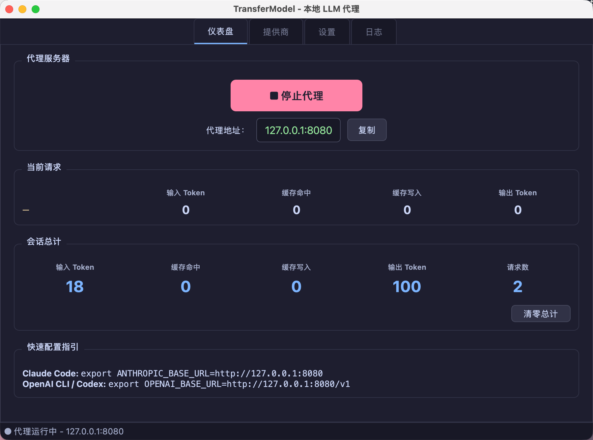
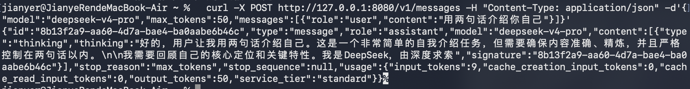

# TransferModel

[](LICENSE)
[](https://www.python.org/)
[]()
[](https://pypi.org/project/PySide6/)
[](https://fastapi.tiangolo.com/)

[English](#english) | [中文](#中文)

本地 LLM API 桌面代理 — 图形化配置、多上游转发、实时 Token 统计。

A local LLM API desktop proxy with GUI configuration, multi-upstream routing, and real-time token tracking.

---

## 中文

### 简介

TransferModel 是一个本地桌面代理应用，在 AI 编码工具（Claude Code、Codex）和 LLM API 提供商之间架设中转层。上游 API Key 只保存在本地，下游工具无需接触真实密钥。

### 功能

- **多上游转发**：支持 Anthropic 和 OpenAI 两种协议，可同时配置多个提供商
- **桌面 GUI**：PySide6 原生桌面界面，无需编辑配置文件
- **实时统计**：仪表盘实时显示输入/输出 Token 用量、缓存命中、会话总计
- **流式透传**：SSE 流式响应零缓冲转发，自动解析 token 用量和回复内容
- **完整日志**：记录每次请求的模型、耗时、Token 明细和回复预览
- **系统托盘**：最小化到托盘后台运行，关闭窗口不退出
- **零依赖构建**：无前端框架、无数据库，单命令启动

### 环境要求

- Python >= 3.13
- [uv](https://docs.astral.sh/uv/) 包管理器

### 安装与启动

#### macOS

```bash
# 安装 uv（如未安装）
curl -LsSf https://astral.sh/uv/install.sh | sh

# 安装依赖
cd TransferModel
uv sync

# 启动
uv run python main.py
```

首次启动若提示"无法验证开发者"，前往 **系统设置 → 隐私与安全性** 点击「仍要打开」。

#### Windows

```powershell
# 安装 uv（如未安装）
powershell -ExecutionPolicy ByPass -c "irm https://astral.sh/uv/install.ps1 | iex"

# 安装依赖
cd TransferModel
uv sync

# 启动
uv run python main.py
```

### 使用步骤

1. 启动应用，在「提供商」标签页点击「添加提供商」
2. 填写上游 API 信息：

   | 字段 | DeepSeek 示例 |
   |------|--------------|
   | API 类型 | `anthropic` |
   | 上游 URL | `https://api.deepseek.com/anthropic` |
   | API Key | `sk-xxxxxxxx` |
   | 模型列表 | `deepseek-v4-pro`（每行一个） |

3. 点击「测试连接」确认连通，然后「保存」
4. 切换到「仪表盘」，点击「启动代理」
5. 状态栏显示绿色即为就绪





### 配置下游工具

**Claude Code（macOS / Linux）：**

```bash
export ANTHROPIC_BASE_URL=http://127.0.0.1:8080
export ANTHROPIC_AUTH_TOKEN=any-value
export ANTHROPIC_MODEL=deepseek-v4-pro
```

**Claude Code（Windows PowerShell）：**

```powershell
$env:ANTHROPIC_BASE_URL="http://127.0.0.1:8080"
$env:ANTHROPIC_AUTH_TOKEN="any-value"
$env:ANTHROPIC_MODEL="deepseek-v4-pro"
```

**Codex CLI：**

创建 `~/.codex/config.toml`：

```toml
model = "deepseek-v4-pro"
model_provider = "transfermodel"

[model_providers.transfermodel]
name = "TransferModel"
base_url = "http://127.0.0.1:8080/v1"
wire_api = "responses"
requires_openai_auth = false
env_key = "OPENAI_API_KEY"
```

```bash
export OPENAI_API_KEY=any-value
codex "hello"
```

> Codex CLI 使用 Responses API (`/v1/responses`)，代理会自动将其翻译为 Chat Completions 格式转发给上游。

建议写入 shell 配置文件（`~/.zshrc` / `~/.bashrc` / Windows 系统环境变量）。

### 模型路由

代理根据请求中的 `model` 字段自动匹配上游提供商：

1. `/v1/messages` → anthropic 协议，`/v1/chat/completions` → openai 协议
2. 在对应协议的已启用提供商中精确匹配模型名
3. 多个匹配时选优先级最低的（数字越小越优先）
4. 无匹配返回 400 + 可用模型列表

### 配置项

所有配置通过环境变量覆盖（前缀 `TM_`），也可在应用内「设置」标签页修改。

| 环境变量 | 默认值 | 说明 |
|----------|--------|------|
| `TM_HOST` | `127.0.0.1` | 监听地址 |
| `TM_PORT` | `8080` | 监听端口 |
| `TM_LOG_LEVEL` | `info` | 日志级别 |
| `TM_DATA_DIR` | `./data` | 数据存储目录 |
| `TM_PROVIDER_TIMEOUT` | `120` | 默认超时（秒） |
| `TM_PROVIDER_PRIORITY` | `10` | 默认优先级 |
| `TM_ANTHROPIC_VERSION` | `2023-06-01` | Anthropic 协议版本 |
| `TM_TEST_TIMEOUT` | `15` | 测试连接超时（秒） |
| `TM_POLL_MS` | `500` | 仪表盘刷新间隔（毫秒） |

示例：

```bash
# macOS / Linux
TM_PORT=9090 TM_LOG_LEVEL=debug uv run python main.py

# Windows PowerShell
$env:TM_PORT="9090"
$env:TM_LOG_LEVEL="debug"
uv run python main.py
```

### 常见上游配置

| 服务商 | API 类型 | 上游 URL |
|--------|---------|----------|
| Anthropic 官方 | anthropic | `https://api.anthropic.com` |
| DeepSeek | anthropic | `https://api.deepseek.com/anthropic` |
| OpenAI 官方 | openai | `https://api.openai.com/v1` |
| 硅基流动 (SiliconFlow) | openai | `https://api.siliconflow.cn/v1` |
| 通义千问 (Qwen) | openai | `https://dashscope.aliyuncs.com/compatible-mode/v1` |

### 数据存储

```
data/
├── providers.json    # 提供商配置
├── settings.json     # 服务器设置
└── proxy.log         # 请求日志
```

### 许可证

MIT License — 详见 [LICENSE](LICENSE)。

---

## English

### Overview

TransferModel is a local desktop proxy that sits between AI coding tools (Claude Code, Codex) and LLM API providers. Upstream API keys are stored only in the proxy — downstream tools never touch them.

### Features

- **Multi-upstream routing** — Supports both Anthropic and OpenAI protocols with multiple providers
- **Desktop GUI** — PySide6 native interface, no config files to edit
- **Real-time statistics** — Live input/output token counts, cache hits, and session totals on the dashboard
- **Streaming pass-through** — Zero-buffer SSE forwarding with automatic token parsing
- **Full logging** — Records model, latency, token breakdown, and response preview for every request
- **System tray** — Minimize to tray, runs in background, closing the window does not quit
- **Zero build toolchain** — No frontend frameworks, no database, single command to launch

### Requirements

- Python >= 3.13
- [uv](https://docs.astral.sh/uv/) package manager

### Installation

#### macOS

```bash
# Install uv (if needed)
curl -LsSf https://astral.sh/uv/install.sh | sh

# Install dependencies
cd TransferModel
uv sync

# Launch
uv run python main.py
```

If macOS blocks the app, go to **System Settings → Privacy & Security** and click "Open Anyway".

#### Windows

```powershell
# Install uv (if needed)
powershell -ExecutionPolicy ByPass -c "irm https://astral.sh/uv/install.ps1 | iex"

# Install dependencies
cd TransferModel
uv sync

# Launch
uv run python main.py
```

### Usage

1. Launch the app, go to the "Providers" tab, click "Add Provider"
2. Fill in the upstream API details:

   | Field | Example (DeepSeek) |
   |-------|-------------------|
   | API Type | `anthropic` |
   | Base URL | `https://api.deepseek.com/anthropic` |
   | API Key | `sk-xxxxxxxx` |
   | Models | `deepseek-v4-pro` (one per line) |

3. Click "Test Connection", then "Save"
4. Switch to the "Dashboard" tab, click "Start Proxy"
5. The status bar turns green when ready


### Configure Downstream Tools

**Claude Code (macOS / Linux):**

```bash
export ANTHROPIC_BASE_URL=http://127.0.0.1:8080
export ANTHROPIC_AUTH_TOKEN=any-value
export ANTHROPIC_MODEL=deepseek-v4-pro
```

**Claude Code (Windows PowerShell):**

```powershell
$env:ANTHROPIC_BASE_URL="http://127.0.0.1:8080"
$env:ANTHROPIC_AUTH_TOKEN="any-value"
$env:ANTHROPIC_MODEL="deepseek-v4-pro"
```

**Codex CLI:**

Create `~/.codex/config.toml`:

```toml
model = "deepseek-v4-pro"
model_provider = "transfermodel"

[model_providers.transfermodel]
name = "TransferModel"
base_url = "http://127.0.0.1:8080/v1"
wire_api = "responses"
requires_openai_auth = false
env_key = "OPENAI_API_KEY"
```

```bash
export OPENAI_API_KEY=any-value
codex "hello"
```

> Codex CLI uses the Responses API (`/v1/responses`). The proxy translates it to Chat Completions format for upstream providers.

Persist these in your shell config (`~/.zshrc` / `~/.bashrc` / Windows system environment).

### Model Routing

The proxy routes requests by matching the `model` field to configured providers:

1. Path determines protocol: `/v1/messages` → anthropic, `/v1/chat/completions` → openai
2. Exact model name match against enabled providers of the correct protocol
3. Lower priority value wins on multiple matches
4. No match returns 400 with the list of available models

### Configuration

All settings can be overridden via environment variables (prefix `TM_`) or changed in the "Settings" tab in-app.

| Variable | Default | Description |
|----------|---------|-------------|
| `TM_HOST` | `127.0.0.1` | Listen address |
| `TM_PORT` | `8080` | Listen port |
| `TM_LOG_LEVEL` | `info` | Log level |
| `TM_DATA_DIR` | `./data` | Data and log directory |
| `TM_PROVIDER_TIMEOUT` | `120` | Default upstream timeout (seconds) |
| `TM_PROVIDER_PRIORITY` | `10` | Default provider priority |
| `TM_ANTHROPIC_VERSION` | `2023-06-01` | Anthropic API version header |
| `TM_TEST_TIMEOUT` | `15` | Test connection timeout (seconds) |
| `TM_POLL_MS` | `500` | Dashboard poll interval (milliseconds) |

Example:

```bash
# macOS / Linux
TM_PORT=9090 TM_LOG_LEVEL=debug uv run python main.py

# Windows PowerShell
$env:TM_PORT="9090"
$env:TM_LOG_LEVEL="debug"
uv run python main.py
```

### Common Provider Configurations

| Provider | API Type | Base URL |
|----------|---------|----------|
| Anthropic (official) | anthropic | `https://api.anthropic.com` |
| DeepSeek | anthropic | `https://api.deepseek.com/anthropic` |
| OpenAI (official) | openai | `https://api.openai.com/v1` |
| SiliconFlow | openai | `https://api.siliconflow.cn/v1` |
| Qwen (DashScope) | openai | `https://dashscope.aliyuncs.com/compatible-mode/v1` |

### Data Storage

```
data/
├── providers.json    # Provider configurations
├── settings.json     # Server settings
└── proxy.log         # Request logs
```

### Project Structure

```
TransferModel/
├── main.py                    # Entry point
├── pyproject.toml             # Dependencies
├── LICENSE                    # MIT
└── transfermodel/
    ├── config.py              # Centralised configuration
    ├── models.py              # Data models
    ├── storage.py             # JSON persistence
    ├── proxy.py               # Streaming proxy + SSE parsing
    ├── routers_proxy.py       # Proxy routes + model routing
    ├── app.py                 # FastAPI app factory
    ├── server.py              # QThread server runner
    ├── logger.py              # Logging (file + Qt signal)
    ├── usage_tracker.py       # Token usage tracker (thread-safe)
    └── ui/
        ├── main_window.py     # Main window
        ├── dashboard_tab.py   # Dashboard (live stats)
        ├── providers_tab.py   # Provider management
        ├── provider_dialog.py # Provider edit dialog
        ├── settings_tab.py    # Settings
        ├── log_tab.py         # Live log viewer
        ├── tray.py            # System tray
        └── styles.py          # Catppuccin dark theme
```

### License

MIT License — see [LICENSE](LICENSE).
